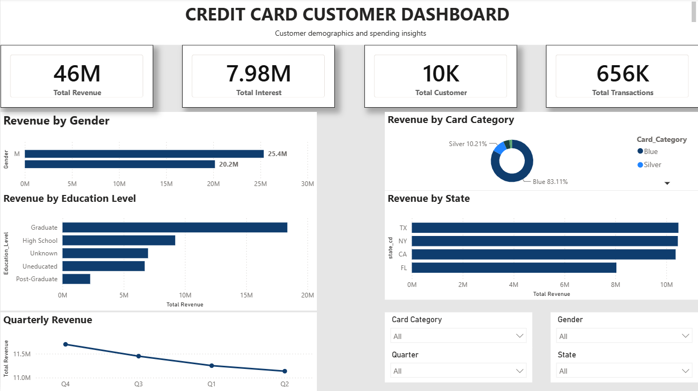
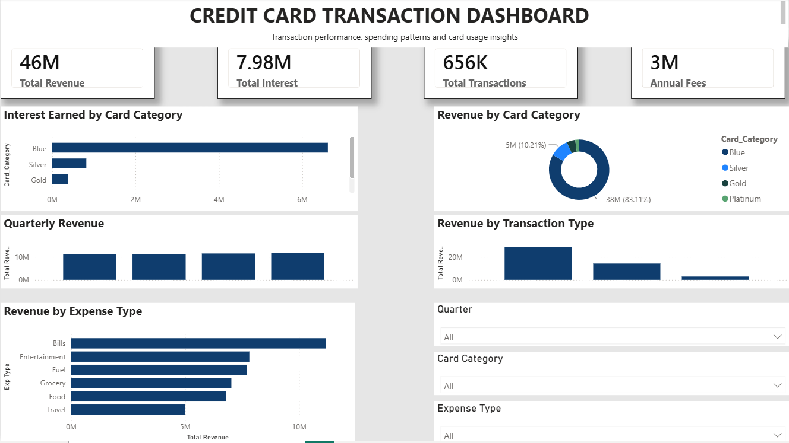

# Credit Card Financial Dashboard

## Project Overview
Developed an interactive Credit Card Financial Dashboard using Power BI and MySQL to analyze customer behavior, transaction trends, revenue generation, and card performance.

## Project Objective

To analyze credit card customer behavior, transaction trends, revenue generation, and interest earnings using MySQL and Power BI. The dashboard provides insights into customer demographics, spending patterns, card category performance, and quarterly revenue trends.

## Tools Used
- Power BI
- MySQL
- Power Query
- DAX
- CSV Datasets

## Key Features
- Customer Analysis Dashboard
- Transaction Analysis Dashboard
- Revenue Tracking
- Interest Earned Analysis
- Card Category Performance

## KPIs
- Total Revenue: 46M
- Total Interest Earned: 7.98M
- Total Customers: 10K
- Total Transactions: 656K

## Dashboard Screenshots

### Customer Dashboard


### Transaction Dashboard


## Project Structure

```text
Credit-Card-Financial-Dashboard
│
├── Dataset
│   ├── customer.csv
│   ├── credit_card.csv
│   ├── cc_add.csv
│   └── cust_add.csv
│
├── Images
│   ├── customer_dashboard.png
│   └── transaction_dashboard.png
│
├── SQL
│   └── credit_card_financial_dashboard.sql
│
├── Power BI
│   └── Credit_Card_Financial_Dashboard.pbix
│
└── README.md
```
